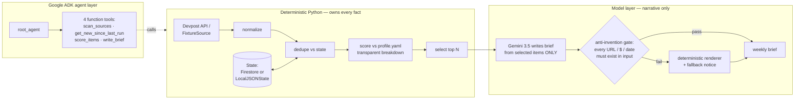

# Opportunity Radar

**An async background agent whose written output is provably grounded.**

Agents write confident prose. The hard part isn't writing it — it's knowing it's
true. Opportunity Radar is a scheduled agent that watches opportunity sources
(hackathons, fellowships, grants) and writes you a weekly brief — and a
deterministic gate validates **every URL, dollar figure, and date** in that
brief against the source data before you ever see it. If the model embellishes,
the output is rejected, a deterministic renderer takes over, and the brief tells
you it did.

The watching is the demo. The gate is the point.

## The problem

High-value, time-boxed opportunities are scattered across a dozen platforms and
only matter until a deadline passes. Nobody wants to poll listing sites weekly;
everybody has missed something they'd have won. The people this bites hardest —
students, indie builders, researchers — are exactly the people without an
assistant to watch for them.

But a summarizing agent that quietly invents a prize amount or a deadline is
worse than no agent at all, because you'll act on it. That's the failure mode
this project is built around.

## The product

A small background agent that runs on a schedule and produces a short brief of
only the *new* opportunities clearing *your* bar:

1. **Fetch** sources (Devpost API today; the `Source` interface is one class per
   new source).
2. **Normalize** into one schema — deterministic parsing, conservative on
   currencies (non-USD prizes are never converted, only shown raw).
3. **Dedupe** against persistent state, so a weekly run only surfaces items
   you've never been shown.
4. **Score** against your `profile.yaml` with fully transparent weights.
5. **Select** the top N deterministically.
6. **Narrate**: Gemini writes the brief **from the selected items only**, and the
   output must pass the anti-invention gate or the deterministic renderer takes
   over (and says so).

## Architecture



**The discipline:** deterministic Python owns fetching, parsing, dedupe,
scoring, and selection. The model *only* writes narrative from already-selected
items — it cannot add, drop, or reprice an opportunity, and the gate proves it
rather than promising it.

**Google stack:** Gemini 3.5 Flash via `google-genai` · Google ADK agent with
four custom function tools · Firestore for cross-run state.

## Status

| Component | State |
|---|---|
| Deterministic pipeline (fetch → normalize → dedupe → score → select) | ✅ 39 tests, all offline |
| Anti-invention gate + eval suite (incl. negative controls) | ✅ executable, exit 0/1, wired into CI |
| CLI end-to-end (`radar scan`, `radar demo`) | ✅ |
| Google ADK agent (`agent.py`, 4 function tools) | ✅ loads and runs under `adk run` (google-adk 2.8.0) |
| Gemini 3.5 narration (`--gemini`) | ⏳ wired + gated by the same `validate_brief`; pending live-key run |
| Firestore state (`--firestore`) | ⏳ wired; pending live run against a billed project |
| Cloud Run Jobs + Cloud Scheduler deploy | 📄 documented in [docs/DEPLOY.md](docs/DEPLOY.md), not executed |

## Spin-up — offline (no key, no network, no cloud)

```bash
python3 -m venv .venv
.venv/bin/pip install -e ".[dev]"

# one-command demo on the bundled fixture:
.venv/bin/radar demo

# the same thing, spelled out:
.venv/bin/python -m opportunity_radar scan \
  --fixtures tests/fixtures/devpost_sample.json \
  --now 2026-08-25T12:00:00 \
  --out brief.md

.venv/bin/python -m pytest -q          # 39 tests, all offline
.venv/bin/python evals/run_evals.py    # golden scenario + gate negative controls
```

Run `scan` twice against the same `--state` file and the second run reports
`new=0` — that's the dedupe doing its job.

## Spin-up — full Google stack

```bash
pip install -e ".[agent,gcp]"
cp .env.example .env        # add your GOOGLE_API_KEY (from aistudio.google.com/apikey)

# 1. Gemini-narrated brief, gated:
python -m opportunity_radar scan --fixtures tests/fixtures/devpost_sample.json --gemini

# 2. Live sources + Gemini + Firestore state:
gcloud config set project YOUR_PROJECT
gcloud services enable firestore.googleapis.com
gcloud firestore databases create --location=nam5
gcloud auth application-default login
python -m opportunity_radar scan --gemini --firestore

# 3. The ADK agent (chains the four tools autonomously):
adk run src/opportunity_radar "Run a radar scan and write me this week's brief."
adk web --port 8000         # dev UI
```

State lands in Firestore collection `opportunity_radar`, document `default`,
with fields `seen_ids` and `last_run` — that's the agent's memory between runs.

## Transparent scoring

All weights live in [`profile.example.yaml`](profile.example.yaml) (copy to
`profile.yaml` and make it yours) and are **printed with every run**. Every
selected item carries its full breakdown:

```
- **Score:** 78.11  (vendor_bonus=+25, theme_match=+20, prize_floor_bonus=+20, urgency=+15.11, ...)
```

Components: vendor-sponsor bonus, theme-keyword matches (capped), USD prize
floor, deadline-proximity urgency, crowded-field penalty, featured bonus. No
hidden magic; changing a number in the YAML *is* changing the model.

## The eval gate

`evals/run_evals.py` (exit code 0/1, wired into CI):

1. **Golden scenario** — frozen clock + checked-in fixture must produce the
   known-good selection, and the rendered brief must pass the gate.
2. **Negative controls** — briefs with a planted fake URL, fake dollar figure,
   and fake deadline must each be *caught*. A gate that can't catch a planted
   lie is not a gate.

The same `validate_brief` function gates real Gemini output at runtime, so the
eval suite tests the production path, not a copy of it.

**Known limits, stated plainly:** the gate checks ISO-format dates (the prompt
mandates ISO output), and validates facts as a set rather than per-sentence —
so it catches invented facts, not facts correctly quoted against the wrong item.
Both are deliberate scope choices for this version.

## Hackathon statement

- **Track:** The Taskmaster — a complete workflow that runs asynchronously in
  the background, not a chatbot.
- **Google stack:** Gemini 3.5 Flash via the Gemini API (`google-genai`);
  Google ADK agent with four custom function tools; Firestore for cross-run
  state. Cloud Run Jobs deployment is documented but not executed.
- **New code:** everything in this repo was written from scratch during the
  submission window (Aug 2026). The concept traces to the author's July 2026
  personal spec; no code was reused.
- **AI assistance:** built with AI pair-assistance (Claude), which the rules
  permit; the running agent is Gemini. All architecture decisions and
  verification are the author's.

## License

Apache-2.0 — see [LICENSE](LICENSE).
