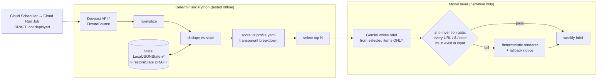

# Opportunity Radar

> ## 🚧 DRAFT STATUS
> Hackathon draft (Google "All Things Agentic", deadline **Aug 31, 2026**).
> **Works and is tested, fully offline:** the entire deterministic pipeline —
> fetch (via fixtures), normalize, dedupe against persistent state, transparent
> scoring, selection, brief rendering, the anti-invention eval gate, and the
> CLI end-to-end (38 pytest tests + a golden-scenario eval, no network, no
> Google packages imported).
> **Written but UNVERIFIED (labeled DRAFT in code):** the live Gemini call
> (`--gemini`), the ADK agent (`agent.py` — never run against a live key),
> `FirestoreState`, and the entire Cloud Run Jobs deploy
> (`deploy/`, `docs/DEPLOY.md` — no command executed). The live Devpost
> endpoint itself was verified 2026-08-24, but tests never hit it.

**An async agent that watches opportunity sources so you don't have to.**

## The problem

High-value, time-boxed opportunities — hackathons, fellowships, grants,
competitions — are scattered across a dozen platforms and only matter until a
deadline passes. Nobody wants to poll listing sites weekly; everybody has
missed something they'd have won. The people this bites hardest (students,
indie builders, researchers) are exactly the people without an assistant to
watch for them.

## The product

Opportunity Radar is a small background agent fleet that runs on a schedule and
sends you a short weekly brief of only the *new* opportunities that clear *your*
bar:

1. **Fetch** sources (Devpost API today; the `Source` interface is one class
   per new source).
2. **Normalize** into one schema — deterministic parsing, conservative on
   currencies (non-USD prizes are never converted, just shown raw).
3. **Dedupe** against persistent state, so a weekly run only surfaces items
   you've never been shown.
4. **Score** against your `profile.yaml` with fully transparent weights.
5. **Select** the top N deterministically.
6. **Narrate**: Gemini writes a short brief **from the selected items only**,
   and the output must pass an anti-invention gate — every URL, dollar figure,
   and date is checked against the input, or the deterministic renderer takes
   over (and says so).

## Architecture



**Discipline:** deterministic Python owns fetching, parsing, dedupe, scoring,
and selection. The model *only* writes narrative from already-selected items —
it cannot add, drop, or reprice an opportunity, and the gate proves it.

## Quickstart — offline (no key, no network)

```bash
python3 -m venv .venv
.venv/bin/pip install -e ".[dev]"

# one-command demo on the bundled fixture:
.venv/bin/radar demo

# the same thing, spelled out:
.venv/bin/python -m opportunity_radar scan \
  --fixtures tests/fixtures/devpost_sample.json \
  --now 2026-08-25T12:00:00 \
  --out brief.md

.venv/bin/python -m pytest -q          # 38 tests, all offline
.venv/bin/python evals/run_evals.py    # golden scenario + gate self-test
```

Run `scan` twice against the same `--state` file and the second run reports
`new=0` — that's the dedupe doing its job.

## Agent mode (DRAFT — needs a Gemini API key)

```bash
pip install -e ".[agent]"
cp .env.example .env   # put your GOOGLE_API_KEY in it

# Gemini-narrated brief (gated; falls back deterministically on any failure):
python -m opportunity_radar scan --fixtures tests/fixtures/devpost_sample.json --gemini

# Google ADK agent (custom tools: scan_sources, get_new_since_last_run,
# score_items, write_brief):
adk run src/opportunity_radar
adk web --port 8000
```

The scheduled production shape is a **Cloud Run Job** triggered by Cloud
Scheduler with Firestore state — written, documented in
[docs/DEPLOY.md](docs/DEPLOY.md), **not yet executed** (DRAFT).

## Transparent scoring

All weights live in [`profile.example.yaml`](profile.example.yaml) (copy to
`profile.yaml` and make it yours) and are **printed with every run**. Every
selected item carries its full breakdown:

```
- **Score:** 78.11  (vendor_bonus=+25, theme_match=+20, prize_floor_bonus=+20, urgency=+15.11, ...)
```

Components: vendor-sponsor bonus, theme-keyword matches (capped), USD prize
floor, deadline-proximity urgency, crowded-field penalty, featured bonus. No
hidden magic; changing a number in the YAML *is* changing the model.

## The eval gate

`evals/run_evals.py` (exit code 0/1, wired into CI):

1. **Golden scenario** — frozen clock + checked-in fixture must produce the
   known-good selection, and the rendered brief must pass the anti-invention
   gate.
2. **Negative controls** — briefs with a planted fake URL, fake dollar figure,
   and fake deadline must each be *caught*. A gate that can't catch a planted
   lie is not a gate.

The same `validate_brief` function gates real Gemini output at runtime.

## Hackathon statement

- **Track:** The Taskmaster (background / async agents) — the whole point is
  an agent that runs while you don't.
- **Google stack:** Google ADK agent with four custom function tools; Gemini
  via `google-genai`; Cloud Run Jobs + Cloud Scheduler + Firestore (deploy
  layer DRAFT).
- **New code:** everything in this repo was written from scratch during the
  hackathon window (Aug 2026). The concept traces to the author's July 2026
  personal spec (a private cron-script version exists); no code was reused.
- **AI assistance:** built with AI pair-assistance (Claude); all architecture
  decisions, verification, and the final deploy are the author's.

## License

Apache-2.0 — see [LICENSE](LICENSE).
